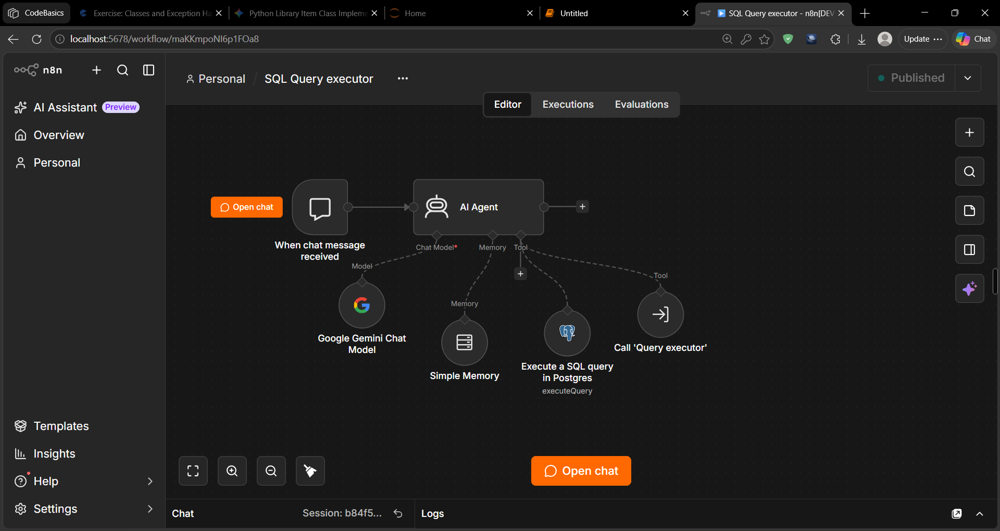
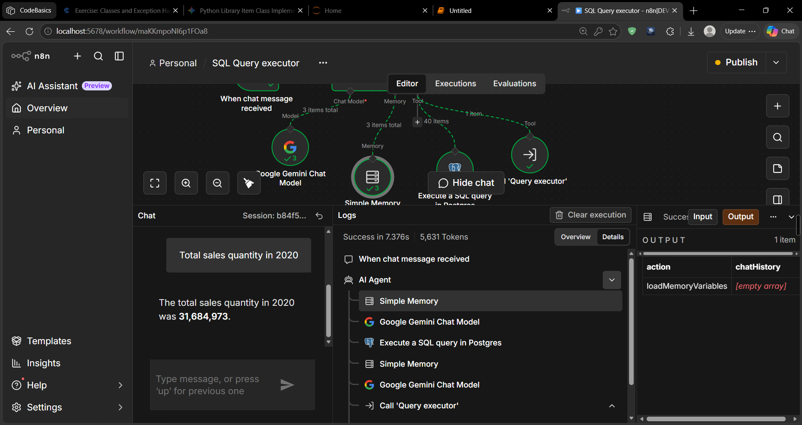

# AI SQL Analytics Assistant

Ask business questions in plain English and receive database-backed answers without writing SQL.

This workflow uses an AI agent to interpret a question, generate the required SQL, run it against PostgreSQL, and return the result conversationally. Simple Memory retains context for follow-up questions.

## How it works

```text
User question → AI Agent + Gemini → SQL query → PostgreSQL / Supabase → Conversational answer
                                  ↕
                            Simple Memory
```



## Validated examples

### Total sales quantity in 2020

**Question:** What was the total sales quantity in 2020?

```sql
SELECT SUM(sold_quantity) AS total_sales_quantity
FROM fact_sales_monthly
WHERE EXTRACT(YEAR FROM date) = 2020;
```

**Result:** **31,684,973 units**



### Top 3 customers in India in 2020

**Question:** Who were the top 3 customers in India based on sales quantity in 2020?

```sql
SELECT c.customer, SUM(s.sold_quantity) AS total_quantity
FROM fact_sales_monthly s
JOIN dim_customer c ON s.customer_code = c.customer_code
WHERE EXTRACT(YEAR FROM s.date) = 2020
  AND c.market = 'India'
GROUP BY c.customer
ORDER BY total_quantity DESC
LIMIT 3;
```

| Customer | Sales quantity |
| --- | ---: |
| Amazon | 920,493 |
| Atliq Exclusive | 812,658 |
| Flipkart | 692,938 |

### Sales comparison: 2019 vs 2020

**Question:** Compare sales between 2019 and 2020.

```sql
SELECT EXTRACT(YEAR FROM date) AS year,
       SUM(sold_quantity) AS total_sales_quantity
FROM fact_sales_monthly
WHERE EXTRACT(YEAR FROM date) IN (2019, 2020)
GROUP BY EXTRACT(YEAR FROM date)
ORDER BY year;
```

| Year | Sales quantity |
| --- | ---: |
| 2019 | 16,452,462 |
| 2020 | 31,684,973 |

Each result above was validated against the PostgreSQL database.

## Example business questions

- Which month had the highest sales?
- What are the top-selling products?
- How have sales changed over time?
- Which customers generated the most revenue?

## Tools used

- n8n
- Google Gemini
- PostgreSQL
- Supabase

## Security

This repository must not include API keys, database passwords, connection strings, service-role keys, or exported credential records. Configure secrets through n8n credentials or environment variables, and review workflow exports and screenshots before publishing.
